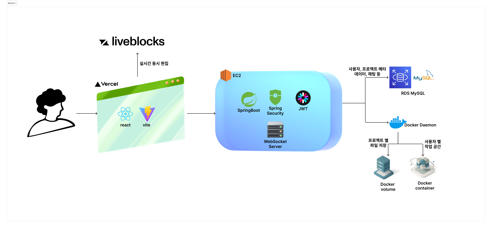

# web-ide-fe
> 구름톤 딥다이브 풀스택 13회차 프론트엔드 
> 개발 기간: 2025.07.11 - 2025.08.03

> BE Github 
> [web-ide-be](https://github.com/GROWLOG-youtube-mockup/web-ide-be)

## 배포주소
[GrowLog Web IDE 페이지](https://growlog-web-ide.vercel.app/)

## 팀 노션 페이지
[GROWLOG - Web IDE](https://hallowed-wave-b3c.notion.site/Web-IDE-22b02a2bdd5380bb84d8f777afb9828b?source=copy_link)

# 팀원 소개

|                                                                                   |                                                                             |                                                                        |
-----|-|-
|
김태현 
                                                                                                  | 
이승준
                                                                                           | 
이재엽
                                                                                     
|

 | 

 | 

 |
|
코드에디터, 탭 기능, 프로젝트 초대 구현
                                                                   | 
계정관련, 메인화면 구현
                                                                         | 
사이드바, 채팅 기능 구현
                                                              

# 프로젝트 소개

## 기술 스택
| Category       | Stack                                                                                             |
|----------------|---------------------------------------------------------------------------------------------------|
| Language       |                                     |
| Framework      |  &nbsp; |
| UI/UX & Styling      |  &nbsp;	|
| Real-time Comm |  &nbsp;  &nbsp;              |
| State Management       |  &nbsp;  &nbsp; |
| Advanced Features |    |
| Tools & Others           |   	       |

## 아키텍쳐

## 주요 기능
**사용자 인증**
- 로그인, 회원가입, 프로필 이미지 설정, 이메일 인증 등의 기능을 제공한다.
- 이메일 인증 절차를 통해 회원가입을 지원한다.
- 프로필 이미지, 비밀번호, 이름 등의 개인 정보를 사용자가 직접 수정할 수 있다.

**메인 페이지**
- 사용자가 속해 있는 프로젝트 목록을 볼 수 있다.
- 본인 소유의 프로젝트와 참여하는 프로젝트를 구분하여 보여준다.

**프로젝트 컨테이너 실행**
- 프로젝트 시작 시, 사용자 전용 Docker 컨테이너를 실행하여 개발 환경을 제공한다.
- 각 프로젝트는 Docker 볼륨을 기반으로 고유한 파일 시스템을 가지며, 이를 통해 사용자 작업 내용을 안전하게 보존한다.
- 템플릿 기반으로 초기 개발 환경이 구성되며, 언어별 사전 정의된 이미지에서 파일이 복사되어 프로젝트 구조를 자동 생성한다.
- 컨테이너는 실시간 코드 편집, 컴파일, 실행 등을 위한 환경을 포함한다.

**채팅**
- 실시간 채팅 및 코드 위치 연결 기능을 제공한다.
- `[텍스트](ide://경로:줄번호)` 방식을 통한 해당 위치 자동 포커싱이 가능하다.

**동시 편집**
- 동일한 파일에 대해 팀원들과 동시에 편집할 수 있는 실시간 협업 기능을 지원한다.

**권한 기반 프로젝트 멤버 관리**
- 프로젝트 구성원은 Owner, Write, Read 권한을 가질 수 있고 권한에 따라 기능 접근이 제한된다.

## 시연 영상
### 사용자 인증

### 프로젝트 생성

### 코드 편집

### 프로젝트 초대

### 채팅

